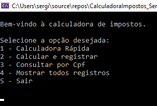
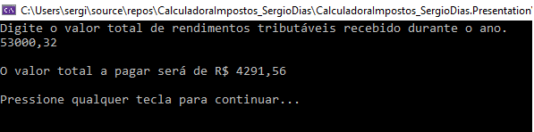
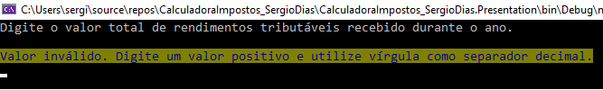
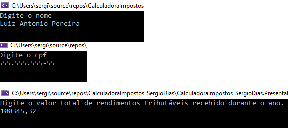
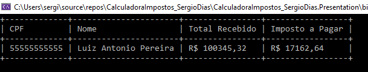
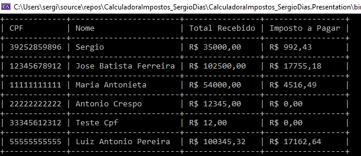

# 💸 Calculadora de Impostos

## Projeto Final do Módulo 2 de POO

O objetivo do projeto é aplicar os conceitos vistos no módulo 2 de POO do curso Top Coders da Let's Code.

> Professor Heber Henrique  
> https://github.com/heberhenrique

 

--- 
 

📋 Conceitos abordados:
- Abstração;
- Generics;
- Aplicação de interfaces e do princípio da Segregação de Interfaces;
- Inversão de controle e injeção de dependência;
- Arquitetura em camadas (presentation, services, domain e repositories);
- Aplicação dos conceitos de SOLID;
- Testes unitários com Xunit.

 

--- 
 

## 📲 Apresentação do Projeto

Menu inicial

 

Primeira opção - Cálculo rápido de valor de imposto, sem registro.

 

Exemplo de validação

 

Exemplo de novo registro

 

Exemplo de busca por CPF

 

Exemplo de lista de registros totais

 

--- 
 

## 🚀 Como executar o programa
- Clonar o repositório em uma pasta local:
    `git clone https://github.com/sergiofdf/CalculadoraImpostos_SergioDias.git`
  
- Abra a solução do projeto com o visual studio, arquivo `CalculadoraImpostos_SergioDias.sln`.

- Execute o projeto com `CTRL + F5`